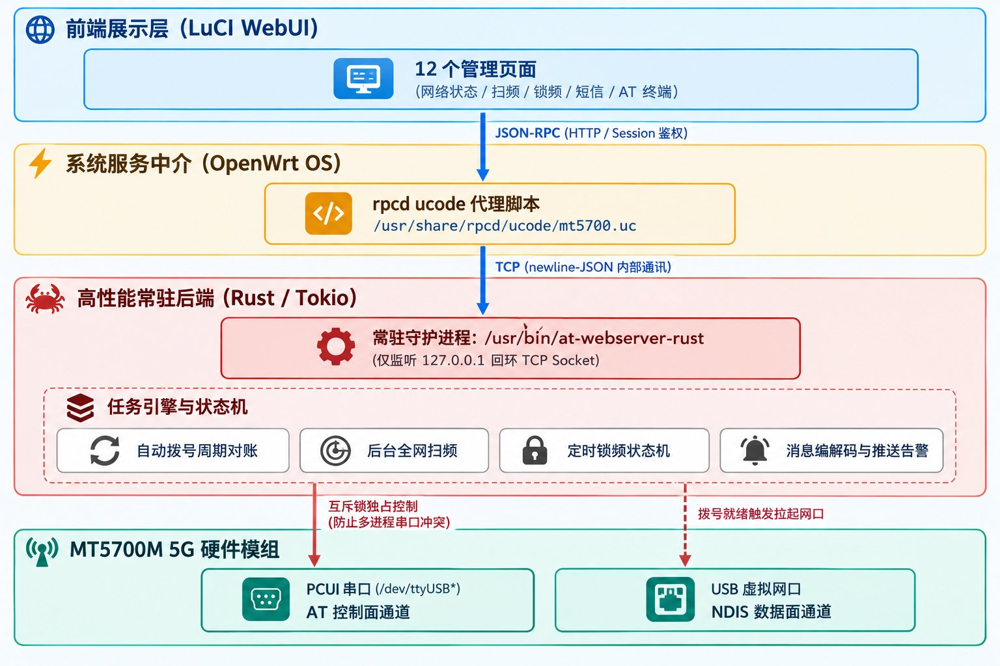
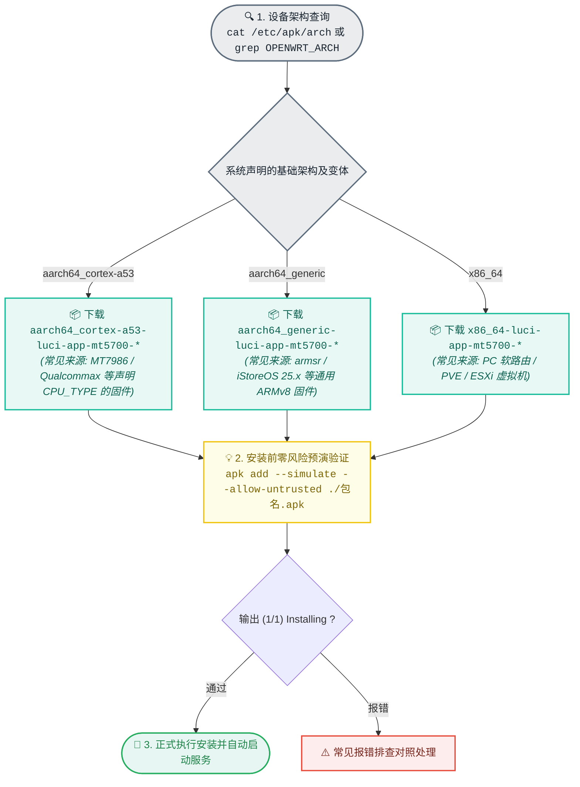
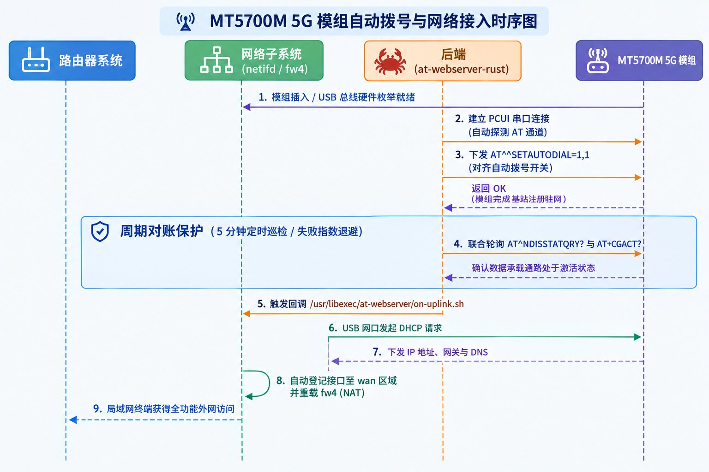

<div align="center">

# AT WebServer · MT5700M 5G 模组管理

OpenWrt / ImmortalWrt 平台下 MT5700M 5G 模组的全功能控制中心与守护套件

[](https://github.com/LianXia233/luci-app-mt5700/releases)
[](https://openwrt.org/)
[](https://immortalwrt.org/)
[](src/rust/)
[](LICENSE)
[](https://lianxia233.github.io/luci-app-mt5700/)

<p align="center">
  <b>单包融合交付</b>：集成 12 个原生 LuCI 现代化管理页面与高性能常驻后端 <code>/usr/bin/at-webserver-rust</code><br>
  涵盖全自动拨号对账、网络状态看板、全网扫频、智能锁频、短信收发与交互式 AT 终端
</p>

</div>

---

| 属性维度 | 设定规范 / 说明 |
|:--|:--|
| **软件包名** | `luci-app-mt5700`（独立语言包：`luci-i18n-mt5700-zh-cn`） |
| **系统服务 / 配置段** | `/etc/init.d/at-webserver` · `/etc/config/at-webserver` |
| **后端进程** | `/usr/bin/at-webserver-rust` (基于 Rust / Tokio 异步事件驱动) |
| **LuCI 入口** | 侧边栏：`移动网络` → `5G 模组管理`（访问路径：`admin/modem/5g`） |
| **在线演示** | [GitHub Pages 静态体验](https://lianxia233.github.io/luci-app-mt5700/)（展示 UI 交互，非真实模组读数） |

---

## 界面预览

<div align="center">
  
  <p><sub>图 1：网络状态控制台（展示 AT 通道状态、信号质谱打分及 5G NR 载波聚合参数）</sub></p>
</div>

> [!TIP]
> **看板实时状态说明**  
> 控制台每秒同步模组底层射频指标：实时监测 RSRP、RSRQ、SINR 及动态信号综合评分；精确显示驻网制式（如 5G NR 中频 2565 MHz / 100 MHz 带宽）与小区 PCI / EARFCN 标识。  
> 页面全部图形按实时数据驱动内联 SVG：**4 联射频仪表盘**（240° 表盘 + 放射刻度 + 巡航游标）、**载波聚合频谱占用图**、**芯片微热力拓扑与 4×2 读数矩阵**、**按当前 MCS 动态生成的 I/Q 星座点阵**；**速率曲线可用鼠标或触摸悬浮查看任一采样点的相对时间与上下行速率**。

> [!NOTE]
> **信号三项的取数来源（`AT^HCSQ`，手册 13.5）**  
> 不同制式的字段数、顺序都不同，插件严格按手册的字段表解析：
>
> | 制式 | value1 | value2 | value3 | value4 |
> |:--|:--|:--|:--|:--|
> | `^HCSQ: "NR",…` | 5G RSRP | 5G SINR | 5G RSRQ | — |
> | `^HCSQ: "LTE",…` | LTE RSSI | LTE RSRP | LTE **SINR** | LTE RSRQ |
> | `^HCSQ: "WCDMA",…` | RSSI | RSCP | Ec/Io | — |
> | `^HCSQ: "GSM",…` | RSSI | — | — | — |
>
> 各字段为编码值（RSRP：`-140 + n` dBm；SINR：`-20 + 0.2n` dB；RSRQ：`-19.5 + 0.5n` dB；RSSI/RSCP：`-121 + n` dBm；Ec/Io：`-32 + 0.5n` dB），`255` 表示未知或不可测，按无数据显示为「—」。
> `^MONSC` 的 LTE 布局与 NR 不同（无 SINR、末位是 RSSI、PCI/ARFCN/TAC 为十六进制），插件按制式分别解析；信号优先取 `^MONSC` 的驻留小区读数，缺项（典型是 4G 下的 SINR）再由 `^HCSQ` 补齐。

---

## 系统拓扑与数据链路

<div align="center">
  
</div>

- **无冲突并发管控**：前端不直连串口，所有 AT 请求统一由 Rust 后端执行互斥锁调度与队列管理，杜绝多进程抢占 TTY 引起的数据截断。
- **超低资源开销**：后端基于 Tokio 异步非阻塞事件驱动，静态内存占用微量，专为低功耗嵌入式路由器优化。

---

## 功能矩阵

系统共集成 12 个独立管理页面（源码位于 `htdocs/luci-static/resources/view/at-webserver/`）：

| 业务域 | 页面名称 | 核心功能与能力说明 |
|:--|:--|:--|
| **射频与基站** | **网络状态** | 4 联射频仪表盘（RSRP / RSRQ / SINR / 综合信号）、载波聚合频谱占用图、芯片微热力拓扑与 4×2 读数矩阵、按 MCS 动态生成的 I/Q 星座图与上下行频谱效率、流量双组看板、IPv4/IPv6 双栈；速率曲线可悬浮查看采样点数据（4G/5G 均按 `^HCSQ` 手册字段表取数，见下） |
| | **网络设置** | 5G/4G 优先模式配置、SA/NSA 模式强制指定、APN 接入点配置 |
| | **全网扫频** | 全频段 / 指定频段快速扫描，导出周边邻区基站列表及物理层信号参数 |
| | **定时锁频** | 支持锁定频段（Band）、频点（EARFCN）与基站物理小区 ID（PCI） |
| **数据与链路** | **拨号设置** | USB NDIS 拨号 / 转网口模式切换，承载网络链路状态守护与自动对账 |
| | **模组设置** | 模组核心元数据查询、软硬件复位重启、出厂配置重置 |
| | **模组升级** | 模组新固件远程推送检测与本地固件包上传刷写 |
| **消息与运维** | **短信中心** | 支持 PDU / Text 短信收发、长短信自动分段重组、SIM 卡短信池查看 |
| | **短信设置** | 自定义短信中心号（SMSC）、自动化短信转发与容量自清理策略 |
| | **AT 调试终端** | Web 原生交互式控制台，支持常用指令自动补全、历史回溯与原语调试 |
| | **通知日志** | 掉线告警、频段漂移记录，支持企业微信机器人与 Webhook 实时推送 |
| | **服务配置** | 守护进程参数、通信串口绑定、退避重试阈值与自愈巡检开关 |

---

## 架构选型决策流

OpenWrt 的软件包架构标识为 `<base>[_<variant>]` 形式，**包管理系统执行严格的 variant 匹配**：



> [!NOTE]
> `aarch64_cortex-a53` 与 `aarch64_generic` 同属于 ARMv8-A 指令集，**底层二进制完全通用**。安装被阻断仅由包管理器元数据校验引起，并非硬件不兼容。

### 1. 确认系统声明的有效架构

```sh
# apk 系统（OpenWrt 25.x / ImmortalWrt SNAPSHOT / iStoreOS 25.x）
cat /etc/apk/arch

# opkg 系统（OpenWrt 24.10 及更早版本）
grep OPENWRT_ARCH /etc/openwrt_release
```

> [!WARNING]
> 切勿使用 `apk --print-arch` 判定。该命令返回的是 apk 编译目标的预设值，并不等同于包管理器运行时依据的 `/etc/apk/arch`。必须以 `/etc/apk/arch` 的首行输出为准。

### 2. 常见包校验报错速查

| 终端报错输出 | 根因剖析 | 推荐解决方案 |
|:--|:--|:--|
| `error: uninstallable arch: aarch64_cortex-a53` | 固件声明架构为 `aarch64_generic` | 改下 `aarch64_generic` 的包；或临时执行：<br>`echo aarch64_cortex-a53 >> /etc/apk/arch` |
| `error: uninstallable arch: aarch64_generic` | 固件声明架构为 `aarch64_cortex-a53` | 重新下载并安装 `aarch64_cortex-a53` 安装包 |
| `error: uninstallable arch: all` | 语言包架构未被识别 | 实测 apk-tools 3.0.5+ 已兼容，若报错可执行：<br>`echo all >> /etc/apk/arch` |
| `luci-app-mt5700 (no such package): required by: luci-i18n-...` | 语言包依赖主包，未合并安装 | 将主包与语言包放入同一条 `apk add` / `opkg install` 指令中 |

---

## 安装与快速启动

### 软件包安装

在 [Releases](https://github.com/LianXia233/luci-app-mt5700/releases) 页面下载与设备架构完全对应的软件包后安装（主包已内嵌 Rust 后端）：

```sh
# 【OpenWrt 25.x / ImmortalWrt SNAPSHOT (apk)】
apk add --allow-untrusted \
  ./<ARCH>-luci-app-mt5700-1.12.8-r1.apk \
  ./<ARCH>-luci-i18n-mt5700-zh-cn-*.apk

# 【OpenWrt 24.10 及更早版本 (opkg)】
opkg install ./<ARCH>-luci-app-mt5700_1.12.8_<ARCH>.ipk
opkg install ./<ARCH>-luci-i18n-mt5700-zh-cn_*.ipk
```

### 快速初始化与启动

```sh
# 1. 提交初始服务配置
uci set at-webserver.config.enabled=1
uci set at-webserver.config.connection_type=SERIAL   # 选用 PCUI 串口直连
uci set at-webserver.config.serial_port=auto         # 自动探测系统 AT 串口
uci commit at-webserver

# 2. 启动服务并验证后端
service at-webserver restart
ls -l /usr/bin/at-webserver-rust
ubus call service list '{"name":"at-webserver"}'
```

---

## 自动拨号与全链路协同机制

> [!CAUTION]
> **重要认知**：模组 AT 握手在线并不等同于路由器具备上网能力。数据面打通需跨越软硬件各层级协同。

<div align="center">
  
</div>

### 各环节职责与协同划分

| 协作环节 | 负责组件 | 运行机制与容灾方案 |
|:--|:--|:--|
| **拨号开关与方式对齐** | Rust 后端 | 建立连接后强制核验；未达成执行退避重试（0/5/15/30/60/120s），每 5 分钟定时巡检对账 |
| **可用性双判决** | Rust 后端 | 联合校验 `AT^NDISSTATQRY?` 与 `AT+CGACT?` 双重指标，杜绝假死虚挂 |
| **承载接口拉起** | init.d + hotplug | 18 次 × 10s 间隔轮询保护；`hotplug.d/iface` 与 `hotplug.d/usb` 动态补发 `ifup` |
| **接口缺失补全** | init.d | 识别到网卡硬件即按 `proto=dhcp` 自动建立 `MT5700M` 与 `MT5700Mv6` |
| **防火墙区域绑定** | init.d | 接口创建后自动登记至 `wan` 区域并重载 `fw4`，打通 `lan → wan` 的 NAT 规则 |

### 故障链路排查速查

| 检查项 | 排查命令 | 预期状态 |
|:--|:--|:--|
| **串口设备识别** | `ls -l /dev/ttyUSB* /dev/ttyACM*` | 至少存在一个可用的 AT 通信口 |
| **自动拨号对账** | `logread -e at-webserver \| grep 自动拨号` | 输出「已处于期望状态」或「复核通过」 |
| **承载接口地址** | `ifstatus MT5700M \| grep -A2 "ipv4-address"` | 存在明确分配的 `address` 字段 |
| **NAT 区域绑定** | `uci show firewall \| grep 'network=.*MT5700M'` | 有输出（**若未绑定区域，会导致有 IP 却上不了网**） |
| **防火墙规约** | `nft list chain inet fw4 srcnat` | 条目中包含模组对应网口（如 `oifname { "eth1" }`） |
| **一键自愈修复** | `/etc/init.d/at-webserver ensure_interfaces` | 重新校验接口并补全防火墙区域登记 |
| **手动重试拉起** | `/etc/init.d/at-webserver on_uplink` | 立即重试触发接口 `ifup` |

---

## 开机自启与自愈机制

- **后端常驻保护（Rust 服务）**：
  - 由 `/etc/uci-defaults/at-webserver` 与 `postinst` 协同创建软链接 `/etc/rc.d/S99at-webserver`。
  - 通过 OpenWrt 原生 `procd` 进程守护，配置 `respawn` 实现异常闪退自动拉起。
  - **自愈机制**：每次调用 `start` 若检测到 `/etc/rc.d` 软链接异常缺失，将自动补齐 `enable`，杜绝因固件文件权限回退（如 100644）造成的永久自启失效。
- **前端接入与热生效（LuCI）**：
  - rpcd 扫描加载 `/usr/share/rpcd/ucode/mt5700.uc`。
  - 安装脚本自动执行 `/etc/init.d/rpcd reload`，实现免重启系统即刻渲染 LuCI 菜单。
- **IPv4 / IPv6 双栈解耦**：
  - `MT5700M` 负责 IPv4 核心通路；`MT5700Mv6` 采用 `reqaddress=try` 动态绑定 `@MT5700M` 设备。即便运营商暂未分配 IPv6 前缀，亦绝不阻塞 IPv4 连通性。

---

## UCI 配置参考 (`/etc/config/at-webserver`)

```ini
config at-webserver 'config'
    option enabled '1'                  # 服务总开关：1=启用，0=禁用
    option connection_type 'SERIAL'     # 通信方式：SERIAL(串口) / TCP(网络回环)
    option serial_port 'auto'           # 串口定位：auto(自动匹配) / custom(手动指定)
    option serial_port_custom '/dev/ttyUSB1' # 手动指定的串口设备绝对路径
    option autodial_enable '1'          # 自动拨号守护开关：1=启用，0=关闭
    option autodial_mode '1'            # 拨号工作模式：1=USB网卡，2=转以太网口模式
    option cellscan_timeout '180'       # 扫频超时阈值(秒)，最低安全下限 10
```

---

## 源码目录结构

```
luci-app-mt5700/
├── Makefile                                # 顶层软件包构建定义 (PKG_VERSION=1.12.8)
├── htdocs/luci-static/resources/
│   ├── view/at-webserver/                  # 12 个 LuCI 页面前端视图脚本
│   └── at-webserver/                       # 前端支撑库 (rpc.js / ui.js / at.css)
├── root/                                   # 系统文件系统镜像结构
│   ├── etc/config/at-webserver             # UCI 默认配置文件
│   ├── etc/init.d/at-webserver             # 核心 init.d 守护脚本 (含接口拉起与自愈)
│   ├── etc/uci-defaults/at-webserver       # 首次刷机安装自愈断言脚本
│   ├── etc/hotplug.d/iface/99-at-webserver # 网络接口变动事件响应
│   ├── etc/hotplug.d/usb/99-at-webserver   # 模组硬件插拔热插拔联动
│   └── usr/
│       ├── libexec/at-webserver/on-uplink.sh # 后端拨号对账就绪通知回调
│       └── share/rpcd/ucode/mt5700.uc      # rpcd 业务代理中间件
├── src/
│   ├── Makefile                            # Rust 后端交叉编译脚本 (带架构校验拦截)
│   └── rust/                               # Rust 后端核心源码仓库
├── po/                                     # 国际化语言包 (zh_Hans)
├── scripts/sdk-build.sh                    # OpenWrt SDK 矩阵自动化打包脚本
└── tests/mock-modem/                       # 自动化测试 Mock 模组服务与 E2E 用例
```

---

## 云编译与发布

本项目依托 GitHub Actions（`.github/workflows/build-openwrt.yml`）实现全自动化矩阵云编译：

- **系统覆盖**：针对 `25.12.5` 自动构建 `apk`；针对 `24.10.8` 自动构建 `ipk`。
- **架构矩阵**：全量覆盖 `x86_64`、`aarch64_cortex-a53`、`aarch64_generic`（共计 6 套构建组合）。
- **硬性断言防御**：构建阶段比对 SDK 输出的 `CONFIG_TARGET_ARCH_PACKAGES` 与矩阵架构标识，不一致立即阻断并硬失败，确保产物元数据绝对精确。
- 编译通过后自动推送构建产物至 [Release](https://github.com/LianXia233/luci-app-mt5700/releases)，并随包打包发布 `ARCH-GUIDE.txt`。

---

## 许可证

本项目遵循 [GNU General Public License v3.0 (GPL-3.0)](LICENSE) 开源协议。
