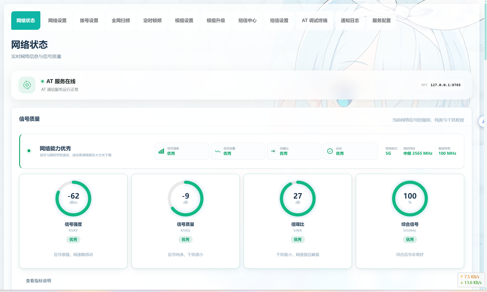

# AT WebServer · MT5700M 5G 模组管理

OpenWrt / ImmortalWrt 的 LuCI 插件，用于管理 MT5700M 5G 模组的拨号、网络状态、扫频、锁频、短信与 AT 调试。单包交付：前端 12 个页面与 Rust 后端 `/usr/bin/at-webserver-rust` 合并安装。

- 包名：`luci-app-mt5700`
- 配置段 / 服务：`at-webserver`
- 版本：v1.12.8
- 入口：LuCI 侧边栏「移动网络 → 5G 模组管理」（`admin/modem/5g`）
- 在线演示：[GitHub Pages](https://lianxia233.github.io/luci-app-mt5700/)（静态示例数据，非真实模组读数）

## 预览



网络状态页：AT 通道状态、信号质量（RSRP / RSRQ / SINR / 综合评分）与驻网信息（5G 中频 2565 MHz / 100 MHz）。

## 架构

LuCI 页面 → rpcd（ucode 代理 `mt5700.uc`）→ Rust 后端（tokio，TCP newline-JSON，仅回环 127.0.0.1）→ 模组 AT 命令。

- 默认连接 PCUI 串口（`SERIAL`，`serial_port=auto` 自动探测），网络 TCP 为备用。
- 串口 / AT、定时锁频、小区扫频、企业微信推送等能力需常驻后端进程，故安装包内含后端二进制。

## 功能

12 个管理页面（`htdocs/luci-static/resources/view/at-webserver/`）：

网络状态 · 网络设置 · 拨号设置 · 全网扫频 · 定时锁频 · 模组设置 · 模组升级 · 短信中心 · 短信设置 · AT 调试终端 · 通知日志 · 服务配置

## 架构与安装包选择

OpenWrt 的包架构名是 `<base>[_<variant>]` 形式，**variant 参与严格匹配**。同样一颗 Cortex-A53，在不同固件上可能是不同的架构名：

| 设备声明的架构 | 典型来源 | 应下载的包 |
|:--|:--|:--|
| `aarch64_cortex-a53` | ImmortalWrt / OpenWrt 的 `mediatek/filogic`、`qualcommax`（`CPU_TYPE:=cortex-a53`） | `aarch64_cortex-a53-luci-app-mt5700-*` |
| `aarch64_generic` | `armsr/armv8`（未定义 `CPU_TYPE`）、iStoreOS 25.x，以及其它把 aarch64 统一为 generic 的固件 | `aarch64_generic-luci-app-mt5700-*` |
| `x86_64` | x86 软路由 / 虚拟机 | `x86_64-luci-app-mt5700-*` |

> 两者都是 ARMv8-A 指令集，**二进制互相兼容**。装不上只是元数据里的 variant 不匹配，不是 CPU 不支持 —— 这是「固件和包的架构看起来都是 aarch64 却装不上」的唯一原因。

### 先确认设备声明的有效架构

```sh
# apk 系统（OpenWrt 25.x / ImmortalWrt SNAPSHOT / iStoreOS 25.x）
cat /etc/apk/arch

# opkg 系统（OpenWrt 24.10 及更早）
grep OPENWRT_ARCH /etc/openwrt_release
```

**不要用 `apk --print-arch` 判断**：它输出的是 apk 二进制编译时的默认架构（实测在 `aarch64_cortex-a53` 设备上输出 `aarch64`），与安装校验实际使用的 `/etc/apk/arch` 列表不是一回事。以 `/etc/apk/arch` 第一行为准。

### 常见报错对照

| 报错 | 含义 | 处理 |
|:--|:--|:--|
| `error: uninstallable arch: aarch64_cortex-a53` | 设备声明的是 `aarch64_generic` | 改下 `aarch64_generic` 的包；或临时 `echo aarch64_cortex-a53 >> /etc/apk/arch`（sysupgrade 后失效） |
| `error: uninstallable arch: aarch64_generic` | 设备声明的是 `aarch64_cortex-a53` | 改下 `aarch64_cortex-a53` 的包 |
| `error: uninstallable arch: all` | 语言包（`PKGARCH=all`）。实测 apk-tools 3.0.5 已把 `all` 视为兼容架构，通常不会遇到 | 确实遇到时 `echo all >> /etc/apk/arch` |
| `luci-app-mt5700 (no such package): required by: luci-i18n-...` | 不是架构问题：语言包声明依赖主包，未同时安装 | 与主包放在同一条 `apk add` / `opkg install` 里 |
| 报错后跟随 `satisfies: world[...]` | 只是依赖求解的上下文，不是另一个问题 | 按上面的 arch 处理 |

### 安装前可先做零风险预演

`apk --simulate` 会走完整的架构校验与依赖求解，但不真正安装：

```sh
apk add --simulate --allow-untrusted ./<ARCH>-luci-app-mt5700-*.apk
```

输出形如 `(1/1) Installing luci-app-mt5700 (1.12.8-r1)` 即表示架构与依赖都已通过；
若报 `uninstallable arch` 则说明选错了架构。Release 中附带的 `ARCH-GUIDE.txt` 是同一份说明，可离线对照。

## 安装

从 [Releases](https://github.com/LianXia233/luci-app-mt5700/releases) 下载与设备架构匹配的包（前端与后端同在一个包内，语言包另装）。

### OpenWrt 25.x / ImmortalWrt SNAPSHOT（apk）

```sh
# 按 cat /etc/apk/arch 的结果替换 <ARCH>
apk add --allow-untrusted \
  ./<ARCH>-luci-app-mt5700-1.12.8-r1.apk \
  ./<ARCH>-luci-i18n-mt5700-zh-cn-*.apk
```

### OpenWrt 24.10 及更早（opkg / ipk）

```sh
opkg install ./<ARCH>-luci-app-mt5700_1.12.8_<ARCH>.ipk
opkg install ./<ARCH>-luci-i18n-mt5700-zh-cn_*.ipk
```

## 快速开始

```sh
uci set at-webserver.config.enabled=1
uci set at-webserver.config.connection_type=SERIAL   # 默认 PCUI 串口
uci set at-webserver.config.serial_port=auto         # 自动探测 AT 口
uci commit at-webserver
service at-webserver restart

# 确认后端随包安装
ls -l /usr/bin/at-webserver-rust
```

登录 LuCI 后进入「移动网络 → 5G 模组管理」即可使用 12 个页面。

## 自动拨号与接口拉起

这是本插件最容易被误解的一环：**模组 AT 在线不等于路由器能上网**。完整链路是

```
USB 枚举 → AT 口就绪 → 模组驻网 → 开启自动拨号(^SETAUTODIAL)
        → 模组向 USB 网口下发 DHCP → netifd 在承载接口上取到地址 → 可上网
```

各环节由谁负责：

| 环节 | 负责方 | 实现位置 |
|:--|:--|:--|
| 对齐自动拨号开关与方式 | Rust 后端 | 每次连上模组后对齐；未达成则退避重试（0/5/15/30/60/120s），并有每 5 分钟的周期对账守护 |
| 确认拨号真的可用 | Rust 后端 | `AT^NDISSTATQRY?` / `AT+CGACT?` 双判据，不只看开关位 |
| 拉起承载接口 | init.d + hotplug + 后端通知 | 三处协同：init.d 带间隔重试 18 次 × 10s；`hotplug.d/iface`、`hotplug.d/usb` 在网口出现时补 `ifup`；后端确认拨号就绪后调用 `/usr/libexec/at-webserver/on-uplink.sh` |
| 接口不存在时创建 | init.d | 检测到模组 USB 网口即按 `proto=dhcp` 创建；检测不到则明确记录原因 |
| 接口登记到防火墙区域 | init.d | 创建/核对接口时一并登记进承载 NAT 的上行区域（`wan`），并重载防火墙 |
| 转网口模式（`autodial_mode=2`） | 模组 | 数据面在以太网口侧，路由器不做 NDIS 判定 |

排查命令：

| 检查项 | 命令 | 预期 |
|:--|:--|:--|
| 串口是否就绪 | `ls /dev/ttyUSB* /dev/ttyACM*` | 至少一个 AT 口 |
| 自动拨号状态 | `logread -e at-webserver \| grep 自动拨号` | 出现「已处于期望状态」或「复核通过」 |
| 接口是否有地址 | `ifstatus MT5700M \| grep -A2 ipv4-address` | 有 `address` 字段 |
| 接口设备名 | `uci get network.MT5700M.device` | 与 `ls /sys/class/net` 中模组网口一致 |
| 接口是否在上行区域 | `uci show firewall \| grep 'network=.*MT5700M'` | 有输出（**不在区域内的接口没有 NAT，会「有 IP 却上不了网」**） |
| NAT 是否对该网口生效 | `nft list chain inet fw4 srcnat` | 跳转条目里含模组网口（如 `oifname { "eth1", "eth2" }`） |
| 有 IP 但上不了网时修复 | `/etc/init.d/at-webserver ensure_interfaces` | 日志出现「已将 MT5700M 登记到防火墙区域 wan」 |
| 手动补一次拉起 | `/etc/init.d/at-webserver on_uplink` | 日志出现 ifup 相关输出 |
| 数据面状态 | AT 终端执行 `AT^NDISSTATQRY?` | 首字段为 `1` |

## 开机自启

前端与后端均随系统开机自动就绪，无需手动配置：

- **后端（Rust 服务）**：服务由本包自带的 `root/etc/uci-defaults/at-webserver`（首次启动执行）与 Makefile `postinst`（安装/升级执行）**显式** `enable`，创建开机软链接 `/etc/rc.d/S99at-webserver`；开机后按 `START=99` 经 procd 拉起 `/usr/bin/at-webserver-rust`（带 respawn 守护）。是否真正启动由 UCI `at-webserver.config.enabled` 控制（默认 `1`）。

  > 注意：OpenWrt **不会**替包自动 enable init 服务，必须显式执行 `enable`。
  > 早期版本曾因 `root/etc/init.d/at-webserver` 执行位回退（100755 → 100644）
  > 导致安装期 enable 以 `Permission denied` 失败；而 enable 只在安装那一刻执行
  > 一次、失败不重试，于是存量设备永久停留在「未注册」状态——重启后服务再也不起来。
  > 为此 `start_service` 内置自愈：每次 start 若发现 `/etc/rc.d` 链接缺失就自动补 `enable`，
  > 存量设备执行一次 `/etc/init.d/at-webserver start` 即永久修好；
  > `uci-defaults` 也会断言注册结果，失败则非零退出以触发系统自带的重试。

- **前端（LuCI 页面）**：页面与菜单（`menu.d`）、权限（`acl.d`）随 rpcd / uhttpd 系统服务自动加载；RPC 代理 `mt5700.uc` 由 rpcd 启动时扫描 `/usr/share/rpcd/ucode/` 自动注册，无独立进程需要管理。安装/升级的 `postinst` 会执行 `/etc/init.d/rpcd reload`，保证新装的 ucode 插件与 ACL 立即生效（**这是「装完即可用」与「重启后才可用」的分界**）。

- **网络接口**：V4 与 V6 接口在缺失时都会自动创建，两者共用模组同一 USB 网口（OpenWrt 默认配置里的 `wan` / `wan6` 也是这种写法）：

  | 接口 | proto | 取址策略 |
  |:--|:--|:--|
  | `MT5700M` | `dhcp` | **必须拿到地址** —— 由带间隔的重试循环、hotplug 钩子、后端拨号就绪通知三路兜底 |
  | `MT5700Mv6` | `dhcpv6` | **按实际网络状况获取**（`reqaddress=try` / `reqprefix=auto`）：运营商下发就取到，不下发也不影响 IPv4 使用。`device` 用 `@MT5700M` 引用上层接口（与机型定制包写法一致，V4 换网口名时自动跟随），并开启 `extendprefix` 把上游前缀分发给 LAN |

  两个接口都是**先创建、再取址**：地址能否拿到取决于运营商与模组状态（IPv6 尤其如此），但接口本身不会因为「此刻还没地址」或「缺少某个客户端」就不存在。创建后置 `auto=1`，并在模组网口就绪后带间隔重试 `ifup`（覆盖 30~60s 的冷启动链路）。两种边界情况都只记录提示、不阻止创建：系统缺少 `odhcp6c` 时 V6 接口仍会创建（装好 `odhcp6c` 即生效）；创建时模组网口尚未枚举时接口先建好，网口出现后自动补上 `device`。

  **安装与升级时**也会同步核对一次接口（`/etc/init.d/at-webserver ensure_interfaces`，由 `postinst` 与 `uci-defaults` 调用）——服务自身的同类检查是在后台跑的，装完那一刻可能还没轮到，所以装完就能在「网络 → 接口」里看到 V4/V6 接口。

  **接口建好之后必须登记进防火墙区域**，否则会出现「模组拨号正常、接口也拿到了 IP、却上不了网」：fw4 只为**区域内的接口**下发源地址转换与 `lan → 上行区域` 的转发放行，接口不在任何区域时内网源地址不会被改写，上游无法回程。本版在创建/核对接口时一并把它登记进承载 NAT 的上行区域（优先名为 `wan` 的区域；没有就找带 `masq` 的区域；都没有则新建一个标准 `wan` 区域并补上 `lan → wan` 转发）。已经装过旧版、此刻正卡在这个状态的设备，执行一次 `/etc/init.d/at-webserver ensure_interfaces` 即可修好。

排查命令：

| 检查项 | 命令 | 预期 |
|:--|:--|:--|
| 开机自启注册 | `ls -l /etc/rc.d/ \| grep at-webserver` | 存在 `S99at-webserver` |
| 注册状态 | `/etc/init.d/at-webserver enabled && echo yes` | 输出 `yes` |
| 运行状态 | `service at-webserver status` | `running` |
| procd 实例 | `ubus call service list '{"name":"at-webserver"}'` | `instance1.running = true` |
| rpcd 插件注册 | `ubus -v list mt5700` | 列出 `at` / `events` / `netrate` |
| 升级后脚本是否生效 | `ls /etc/init.d/at-webserver*` | 无 `at-webserver.apk-new` 残留（apk 的受保护路径机制会把新版留在该文件里，本版 postinst 已自动合并） |
| 接口是否齐全 | `/etc/init.d/at-webserver ensure_interfaces` 后 `uci show network \| grep MT5700M` | 存在 `MT5700M` 与 `MT5700Mv6` 两段 |
| 启动日志 | `logread -e at-webserver` | 无 `Permission denied` / `enable 失败` |

页面显示「未注册」时的手动修复：`/etc/init.d/at-webserver enable && /etc/init.d/at-webserver start`。

## UCI 配置

配置文件：`/etc/config/at-webserver`。常用键：

| 键 | 默认 | 说明 |
|:--|:--|:--|
| `config.enabled` | `1` | 启用服务 |
| `config.connection_type` | `SERIAL` | 连接类型，默认 PCUI 串口 |
| `config.serial_port` | `auto` | 串口设备；`auto` 按 sysfs 接口名自动探测 AT 口（优先 PCUI） |
| `config.serial_port_custom` | `/dev/ttyUSB1` | `serial_port=custom` 时使用 |
| `config.autodial_enable` | `1` | 连上模组后确保开启自动拨号 |
| `config.autodial_mode` | `1` | 1=USB 网络接口，2=转网口模式 |
| `config.cellscan_timeout` | `180` | 单次扫频允许运行秒数（下限 10） |

页面修改采用暂存式「保存并应用」：改动控件后点击「保存并应用」才写入并生效（`uci changes → save → apply`；无待应用变更时视为已生效）。拨号页**不会**再把模组的观测状态静默写成配置。

## 项目结构

```
luci-app-mt5700/
├── Makefile                   # 包定义（PKG_VERSION=1.12.8）
├── htdocs/luci-static/resources/
│   ├── view/at-webserver/     # 12 个页面 JS
│   └── at-webserver/          # rpc.js / ui.js / at.css 等前端资源
├── root/
│   ├── etc/config/at-webserver
│   ├── etc/init.d/at-webserver          # 服务、串口绑定、接口拉起（含 on_uplink 动作）
│   ├── etc/uci-defaults/at-webserver    # 首次安装初始化 + 开机自启注册断言
│   ├── etc/hotplug.d/iface/99-at-webserver   # 接口事件 → 补 ifup
│   ├── etc/hotplug.d/usb/99-at-webserver     # 模组插拔/重枚举 → 补拉起
│   └── usr/
│       ├── libexec/at-webserver/on-uplink.sh # 后端拨号就绪通知入口
│       └── share/
│           ├── luci/menu.d/luci-app-mt5700.json
│           └── rpcd/acl.d/luci-app-mt5700.json
├── src/Makefile               # 顺带 cargo build 后端（含架构映射与硬失败校验）
├── src/rust/                  # Rust 后端（Cargo 版本 1.5.0）
├── po/                        # 翻译模板与 zh_Hans
├── scripts/sdk-build.sh       # SDK 内构建与架构元数据输出
└── tests/mock-modem/          # 测试用 mock 模组 + e2e
```

## 云编译与发布

GitHub Actions（`.github/workflows/build-openwrt.yml`）对每个推送做云编译：

- `25.12.5` → apk；`24.10.8` → ipk
- 架构矩阵：`x86_64` / `aarch64_cortex-a53` / `aarch64_generic`（共 6 个组合）
- 构建期强制核对：SDK 实际上报的 `CONFIG_TARGET_ARCH_PACKAGES` 必须等于矩阵登记的架构，否则构建失败（防止把错架构的包发出去）
- 编译成功自动发布 [Release](https://github.com/LianXia233/luci-app-mt5700/releases)，并附带 `ARCH-GUIDE.txt`

## 许可证

[GNU General Public License v3.0](LICENSE)
